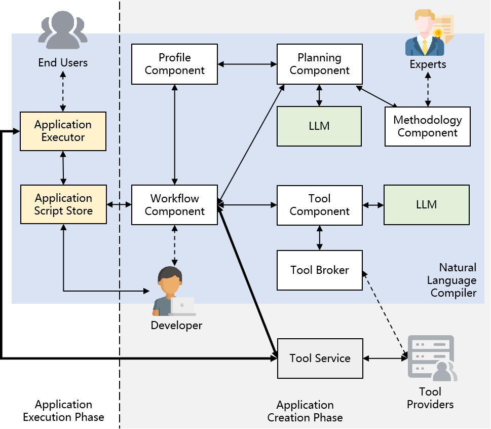

# Novel Application Creation Paradigm using Natural Language Compiler


The rapid development and applications of Large Language Model (LLM) technology increasingly facilitate its use in app creation. Although "LLM Aided Coding" can reduce the need for developers to have advanced computer technology skills, it still requires them to master the use of computer programming languages. For "LLM-Enabled Applications" and "AI Agents", creating apps directly based on LLM can significantly reduce the complexity and workload of app creation. However, the execution phase of these applications still relies on LLM, which greatly limits their operational efficiency and cost due to this dependency. In this paper, we propose a new application creation paradigm using a Natural Language Compiler (NLC) based on LLM. The introduction of NLC allows developers to develop and deploy applications by simply describing the app requirements in natural language and performing relatively simple configurations, without relying on LLM during the execution phase. NLC draws on the architecture of AI Agents and further introduces Methodology Component to address the issue of hallucinations caused by the lack of facts in planning, thus enhancing the expandability of planning capabilities. It adopts a "register-discover-invoke" mechanism to support the flexible expansion of tools. These improvements maintain the convenience of application creation while enabling NLC to have a stronger and more flexible application creation capability. 


<div align=center>  </div>

## Demonstrations

### Video


### Planning

Assuming that there already exists a methodology in Methodology Capcability:

```text
How to choose a family travel destination:

1. Search for {{ home_city }}
2. Query cities less than 200 kilometers away from the home city
3. Sort the HSR fares from the selected cities to the home city (from lowest to highest)
```

The Planning Component consults the Methodology Component for methods to solve the issue. Once a method is identified, it is returned to the Planning Component, which, using this information, generates a structured workflow description with the assistance of an LLM.

<div align=center>  </div>

### Expand Methodology and Tools for updating Application

On the interactive page provided by Methodology Component, We add a subtask named "Excluding cities with adverse weather during the travel period".

previous:

<div align=center>  </div>

current:

<div align=center>  </div>

Tool Provider register a new tool, the function of this tool is to provide weather service.

<div align=center>  </div>

Now, as we regenerate the application, the new app includes Task 4 along with the corresponding newly registered tool.

previous:

<div align=center>  </div>

current:

<div align=center>  </div>

## Deploy NLC

### Install required modules
python version = 3.10
```shell
pip install -r requirements.txt
```

### Configuration

Copy `config.ini.template` to the same directory, and name it `config.ini`, fill in the configuration in it

### Run

Reception Component & Workflow Component & Profile Component

```shell
streamlit run action/reception.py --server.port 8000
```

Planning Component

```shell
python planning.py
```

Methodology Component

```shell
python methodology/app.py
```

Tool Component
```shell
python tool/ToolComponent.py
```

Tool Broker
```shell
python tool/ToolBroker.py
```

Tool Frame
```shell
python tool/ToolFrame.py
```

Tool Service

```shell
# City Mileage Service
python tool/services/app01.py

# HSR Fare Service
python tool/services/app02.py

# Weather Service
python tool/services/app03.py
```